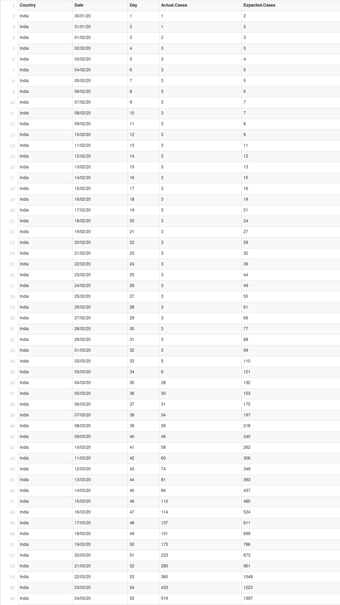
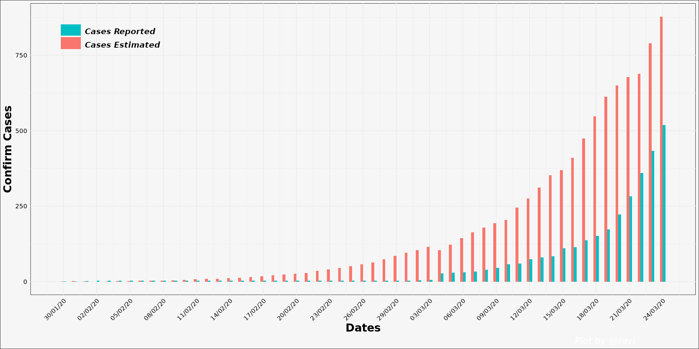

# <u><b>COVID-19 : India</b></u>
This repository is made in order to track the growth of **novel Coronavirus Dieases (COVID-19)** in India. 

Here we transform the availed data to generate a time-series dataset.  

 

We aim to do the analysis that how good the **21 days' lockdown** is, for the government. 
It also makes an estimate whether what would have been the number of cases till _March 24th_ i.e. since when the lockdown came into action. 

### Reported & Estimated number of cases/day:
Here is the <u>estimated</u> value for the confirmed cases that are actually reported.

#### Table

#### Visualization

 

The main aim of this project work is to analysis that how effective the COVID-19 is, herein India and hence why every-one must consider the warnings seriously & mind the social distencing.

 

### Bibliography
Data Source: 
> 1. [Ministry of Health and Family Welfare - India](https://www.mohfw.gov.in/)
> 2. [Kaggle](https://www.kaggle.com/)
> 3. [covid19india](https://www.covid19india.org/) Tracker
> 4. The besic idea for this analysis was driven from [GitHub repo.](https://github.com/midas-network/COVID-19/tree/master/parameter_estimates/2019_novel_coronavirus)
